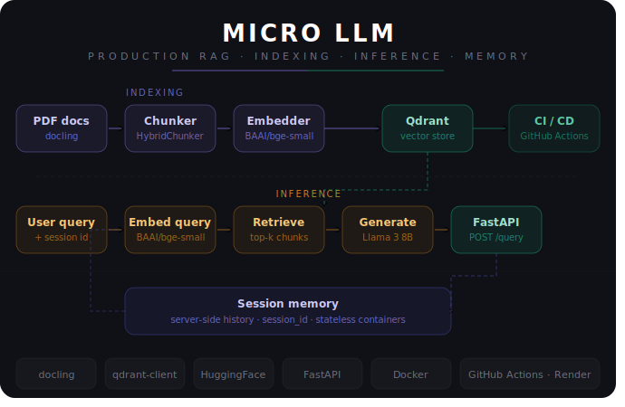

# Micro LLM



> A production-grade Retrieval-Augmented Generation (RAG) microservice — from raw PDFs to a live conversational API with session memory.

---

## 🏗️ Architecture Overview

Micro LLM follows a **microservices architecture** split across two independent services:

```
┌─────────────────────────────────────┐       ┌──────────────────────────────────────┐
│         Indexing Service            │       │          Inference Service             │
│     (Dockerfile.indexing)           │       │       (Dockerfile.inference)           │
│                                     │       │                                        │
│  ┌──────────────────────────────┐   │       │   ┌────────────────────────────────┐  │
│  │  Load PDFs via docling       │   │       │   │  Embed query (BAAI/bge-small)  │  │
│  │  OCR + table extraction      │   │       │   └──────────────┬─────────────────┘  │
│  └──────────────┬───────────────┘   │       │                  ▼                    │
│                 ▼                   │       │   ┌────────────────────────────────┐  │
│  ┌──────────────────────────────┐   │       │   │  Retrieve top-k from Qdrant    │  │
│  │  Chunk via HybridChunker     │   │       │   └──────────────┬─────────────────┘  │
│  │  Structure-aware splitting   │   │       │                  ▼                    │
│  └──────────────┬───────────────┘   │       │   ┌────────────────────────────────┐  │
│                 ▼                   │       │   │  Generate via Llama 3 8B (HF)  │  │
│  ┌──────────────────────────────┐   │───────▶   └──────────────┬─────────────────┘  │
│  │  Embed via BAAI/bge-small    │   │       │                  ▼                    │
│  │  Upsert to Qdrant Cloud      │   │       │   ┌────────────────────────────────┐  │
│  └──────────────────────────────┘   │       │   │  FastAPI · POST /query         │  │
│                                     │       │   │  Session memory · /health      │  │
└─────────────────────────────────────┘       │   └────────────────────────────────┘  │
         ↑ triggers on every push to main     └──────────────────────────────────────┘
```

---

## 🔄 CI/CD Pipeline

Every push to `main` automatically:

1. **Runs the indexing pipeline** (`uv run index`) — loads PDFs, chunks, embeds and upserts to Qdrant Cloud
2. **Builds & pushes** both Docker images to Docker Hub (tagged `:latest` + `:<git-sha>`)
3. **Inference service** on Render automatically picks up the new image

```
Push to main
     │
     ▼
 ┌──────────────────┐     ┌─────────────────────────────┐
 │  Indexing Job    │────▶│  Embed & upsert to           │
 │  uv run index    │     │  Qdrant Cloud                │
 └──────────────────┘     └─────────────────────────────┘
          │
          ▼
 ┌──────────────────────────────┐
 │  Docker Job                  │
 │  Build & push                │
 │  micro-llm-indexing          │
 │  micro-llm-inference         │
 └──────────────────────────────┘
          │
          ▼
 ┌──────────────────────────────┐
 │  Render                      │
 │  Auto-deploys inference API  │
 └──────────────────────────────┘
```

---

## 🛠️ Tech Stack

| Layer | Tool | Purpose |
|---|---|---|
| **Package & Env** | [`uv`](https://github.com/astral-sh/uv) | Fast dependency management |
| **Linting** | [`prek`](https://github.com/kashifulhaque/prek) | Rust-based pre-commit formatting |
| **Task Runner** | [`just`](https://github.com/casey/just) | Script orchestration |
| **PDF Loading** | [`docling`](https://github.com/DS4SD/docling) | OCR + table-aware PDF extraction |
| **Chunking** | [`HybridChunker`](https://docling-project.github.io/docling/) | Structure-aware document chunking |
| **Embeddings** | [`BAAI/bge-small-en-v1.5`](https://huggingface.co/BAAI/bge-small-en-v1.5) | Local HuggingFace embeddings |
| **Vector DB** | [`Qdrant Cloud`](https://cloud.qdrant.io/) | Managed vector store |
| **LLM** | [`Llama 3 8B Instruct`](https://huggingface.co/meta-llama/Meta-Llama-3-8B-Instruct) | Answer generation via HF Inference API |
| **Config** | [`hydra-core`](https://hydra.cc/) + [`omegaconf`](https://omegaconf.readthedocs.io/) | Hierarchical configuration |
| **API** | [`FastAPI`](https://fastapi.tiangolo.com/) + [`uvicorn`](https://www.uvicorn.org/) | RAG REST API with session memory |
| **Containers** | [`Docker`](https://www.docker.com/) + [`Docker Compose`](https://docs.docker.com/compose/) | Containerized services |
| **Registry** | [`Docker Hub`](https://hub.docker.com/) | Container image hosting |
| **CI/CD** | [`GitHub Actions`](https://github.com/features/actions) | Automated indexing & deployment |
| **Deployment** | [`Render`](https://render.com/) | Live FastAPI hosting via Docker |

---

## 🚀 Getting Started

### Prerequisites

- [uv](https://github.com/astral-sh/uv) installed
- [Docker](https://www.docker.com/) installed
- [just](https://github.com/casey/just) installed
- Qdrant Cloud account + cluster
- Hugging Face account + token (with Llama 3 access)

### Local Development

```bash
# Clone the repo
git clone https://github.com/harishgehlot/micro_llm.git
cd micro_llm

# Install dependencies
uv sync

# Add your environment variables
cp .env.example .env
# Fill in: HF_TOKEN, QDRANT_CLUSTER_ENDPOINT, QDRANT_API_KEY

# Run indexing pipeline (loads docs → chunks → embeds → upserts to Qdrant)
uv run index

# Start the inference API
uv run uvicorn micro_llm.entrypoints.inference_endpoint:app --reload --port 8001
```

### Local Docker (both services)

```bash
docker compose up
# Inference API → http://localhost:8001/docs
```

---

## 📡 API Reference

### `GET /health`

```json
{
  "status": "ok"
}
```

### `POST /query`

**First request — start a new session:**
```json
{
  "question": "What is the attention mechanism?",
  "session_id": null
}
```

**Response:**
```json
{
  "answer": "The attention mechanism maps a query and a set of key-value pairs to an output...",
  "sources": ["src/micro_llm/docs/attention_is_all_you_need.pdf"],
  "session_id": "a26e8902-692a-4dac-90cb-dee531ab9580"
}
```

**Follow-up — continue the conversation:**
```json
{
  "question": "Can you elaborate on scaled dot-product attention?",
  "session_id": "a26e8902-692a-4dac-90cb-dee531ab9580"
}
```

The server maintains conversation history per session — the client only needs to pass the `session_id`.

---

## 🧠 Session Memory

Micro LLM uses **server-side session memory** — no need to send history with every request.

```
Request 1:  question + session_id: null   →  server creates session
Response 1: answer  + session_id: "abc"   →  client stores session_id

Request 2:  question + session_id: "abc"  →  server loads history
Response 2: answer with full context      →  model remembers previous turns
```

Sessions are stored in memory and reset on server restart. For persistent sessions, Redis can be plugged in as a drop-in replacement.

---

## 🐳 Docker Images

| Image | Docker Hub |
|---|---|
| Indexing | `harishgehlot/micro-llm-indexing:latest` |
| Inference | `harishgehlot/micro-llm-inference:latest` |

```bash
# Run inference locally
docker run -p 8001:8001 \
  -e HF_TOKEN=your_token \
  -e QDRANT_CLUSTER_ENDPOINT=your_endpoint \
  -e QDRANT_API_KEY=your_key \
  harishgehlot/micro-llm-inference:latest
```

---

## 📁 Project Structure

```
micro_llm/
├── src/
│   └── micro_llm/
│       ├── conf/
│       │   └── config.yaml         # Hydra config
│       ├── docs/                   # PDF documents to index
│       ├── entrypoints/
│       │   ├── indexing_endpoint.py
│       │   └── inference_endpoint.py
│       ├── pipelines/
│       │   ├── indexing.py
│       │   └── inference.py
│       └── scripts/
│           ├── load.py             # PDF loading via docling
│           ├── chunker.py          # HybridChunker
│           ├── embed.py            # Embeddings + Qdrant upsert
│           ├── vectordb.py         # Qdrant connection utility
│           ├── retriever.py        # Semantic search
│           └── generator.py        # LLM answer generation
├── .github/
│   └── workflows/
│       └── ci.yaml
├── Dockerfile.indexing
├── Dockerfile.inference
├── docker-compose.yaml
├── pyproject.toml
└── justfile
```

---

## 🔑 Environment Variables

| Variable | Description |
|---|---|
| `HF_TOKEN` | Hugging Face API token (requires Llama 3 access) |
| `QDRANT_CLUSTER_ENDPOINT` | Qdrant Cloud cluster URL |
| `QDRANT_API_KEY` | Qdrant Cloud API key |